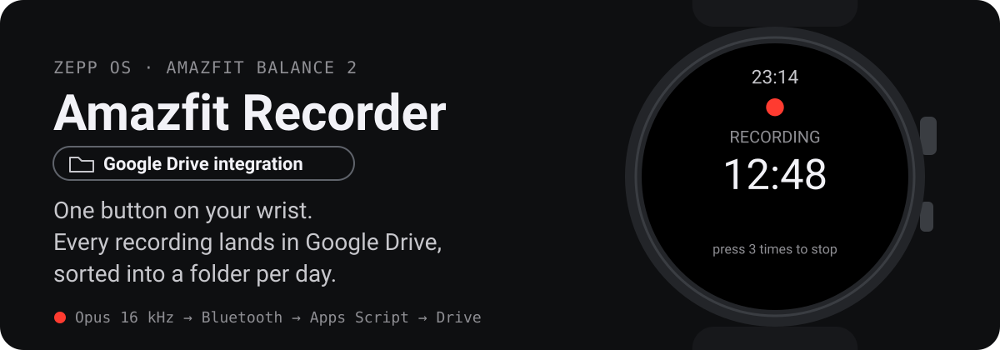
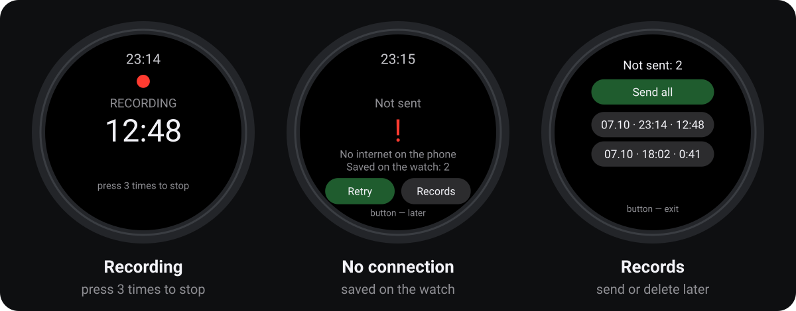
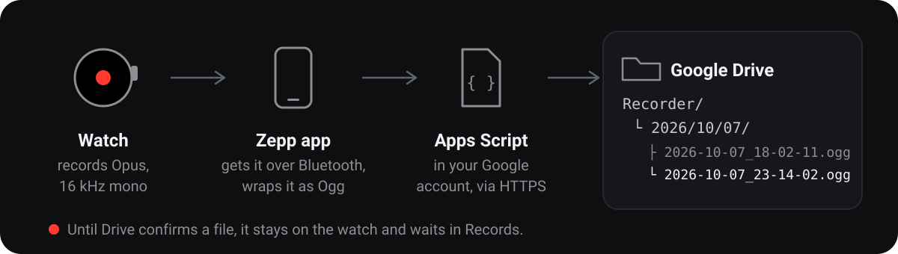

<p align="center">
  
</p>

<p align="center"><b>English</b> · <a href="README.ru.md">Русский</a></p>

## Why

A lot gets said in a day: tasks in a meeting, a promise in the hallway, an idea on the way home. Taking out the phone to record is slow, and the watch is already on your wrist.

This app turns an Amazfit Balance 2 into a one-button voice recorder. Every recording goes to **your own** Google Drive, into a folder per day, ready to listen to or transcribe later.

<p align="center">
  
</p>

## How it works

<p align="center">
  
</p>

1. **Record.** Open the app (best: put it on a watch button). Recording starts right away. Press the button three times to stop. A single accidental press does nothing.
2. **Check.** The watch checks the whole path: watch → phone → internet. If a step is missing, it says which one.
3. **Send.** The audio goes over Bluetooth to the Zepp app on the phone, which wraps it as Ogg Opus and uploads it through a small Google Apps Script in your account.
4. **Keep it safe.** A file is deleted from the watch only after Google Drive confirms it. Until then it waits under **Records**, where you can send or delete it.

## Setup

You need an Amazfit Balance 2, the Zepp app (tested on Android), a Google account and Node.js 18 or newer. The watch interface follows the watch language: English or Russian.

1. **Receiver.** Create a project at [script.google.com](https://script.google.com), paste [`apps_script/Code.gs`](apps_script/Code.gs) and set your own `TOKEN` (any long random string). `ROOT_FOLDER` is the Drive folder name, `Recorder` by default. Run `authorize` once, then Deploy → New deployment → Web app: execute as **Me**, access **Anyone**.
2. **Config.** Copy `app-side/config.example.js` to `app-side/config.js` and paste the web app URL (ends with `/exec`) and the same token.
3. **Install.** In the Zepp app turn on developer mode: Profile → Settings → About, tap the Zepp logo 7 times. Then on the computer:

   ```bash
   npm install
   npx zeus login
   npm run preview
   ```

   Scan `test_out/preview_qr.png` in Zepp: Profile → your watch → Developer mode → scan icon → Install.
4. **Button.** On the watch: Settings → Preferences → assign the recorder to a button press.

Check the receiver without the watch: `node tools/test_drive.cjs`. Check the audio pipeline: `npm test`.

## Limits

- Zepp OS lets third-party apps record only while their screen is on, so the screen stays on during a recording. It is black to save power. There is no background recording and no voice activation.
- Bluetooth is the slow part of the trip. The speed is shown while sending.
- Recording other people depends on local law and workplace rules. Tell people when you record.

## Inside

| Path | What it does |
| --- | --- |
| `page/` | Watch screens: recording, sending, Records |
| `app-side/` | Runs in the Zepp app: Opus → Ogg, upload to Drive |
| `apps_script/Code.gs` | Receiver in your Google account |
| `tools/` | Tests without the watch, QR code for installing |

## License

[MIT](LICENSE)
