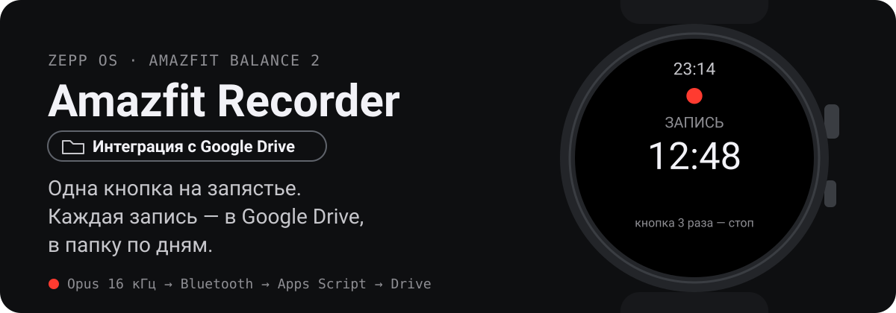
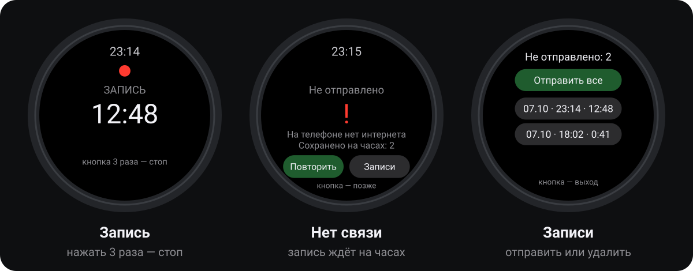
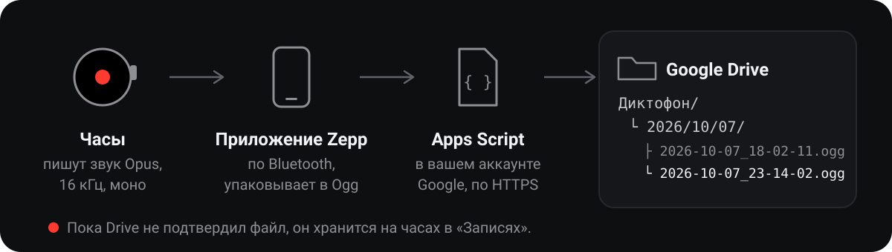

<p align="center">
  
</p>

<p align="center"><a href="README.md">English</a> · <b>Русский</b></p>

## Зачем

За день звучит много важного: задачи на встрече, обещание в коридоре, идея по дороге домой. Достать телефон и включить диктофон долго, а часы уже на руке.

Это приложение превращает Amazfit Balance 2 в диктофон на одну кнопку. Каждая запись попадает в **ваш** Google Drive, в папку по дням: её можно послушать или расшифровать позже.

<p align="center">
  
</p>

## Как это работает

<p align="center">
  
</p>

1. **Запись.** Откройте приложение (удобнее всего назначить его на кнопку часов), и запись начнётся сразу. Чтобы остановить, нажмите кнопку три раза. Одно случайное нажатие ничего не делает.
2. **Проверка.** Часы проверяют весь путь: часы → телефон → интернет. Если где-то нет связи, они так и пишут.
3. **Отправка.** Звук идёт по Bluetooth в приложение Zepp на телефоне. Оно упаковывает его в Ogg Opus и загружает через небольшой скрипт Google Apps Script в вашем аккаунте.
4. **Сохранность.** Файл удаляется с часов только после того, как Google Drive подтвердил сохранение. До этого он лежит в разделе **«Записи»**, где его можно отправить или удалить.

## Установка

Нужны Amazfit Balance 2, приложение Zepp (проверено на Android), аккаунт Google и Node.js 18 или новее. Интерфейс на часах следует языку часов: русский или английский.

1. **Приёмник.** Создайте проект на [script.google.com](https://script.google.com), вставьте [`apps_script/Code.gs`](apps_script/Code.gs) и задайте свой `TOKEN` (любая длинная случайная строка). `ROOT_FOLDER` — имя папки в Drive, по умолчанию `Recorder`, можно поставить `Диктофон`. Один раз запустите `authorize`, затем «Развернуть» → «Новое развертывание» → «Веб-приложение»: запуск от имени «Я», доступ «Все».
2. **Настройка.** Скопируйте `app-side/config.example.js` в `app-side/config.js` и впишите адрес веб-приложения (заканчивается на `/exec`) и тот же токен.
3. **Установка на часы.** В приложении Zepp включите режим разработчика: «Профиль» → «Настройки» → «О приложении», 7 раз нажмите на значок Zepp. Потом на компьютере:

   ```bash
   npm install
   npx zeus login
   npm run preview
   ```

   Отсканируйте `test_out/preview_qr.png` в Zepp: «Профиль» → ваши часы → «Режим разработчика» → значок сканера → «Установить».
4. **Кнопка.** На часах: «Настройки» → «Предпочтения» → назначьте диктофон на нажатие кнопки.

Проверить приёмник без часов: `node tools/test_drive.cjs`. Проверить обработку звука: `npm test`.

## Ограничения

- Zepp OS разрешает сторонним приложениям записывать звук, только пока их экран включён, поэтому во время записи экран горит. Он чёрный, чтобы экономить заряд. Фоновой записи и включения голосом нет.
- Самое медленное звено — Bluetooth. Скорость видна на экране во время отправки.
- Запись других людей регулируется законом и правилами на работе. Предупреждайте, что ведёте запись.

## Что внутри

| Путь | Что делает |
| --- | --- |
| `page/` | Экраны часов: запись, отправка, «Записи» |
| `app-side/` | Работает в приложении Zepp: Opus → Ogg, загрузка в Drive |
| `apps_script/Code.gs` | Приёмник в вашем аккаунте Google |
| `tools/` | Тесты без часов, QR-код для установки |

## Лицензия

[MIT](LICENSE)
